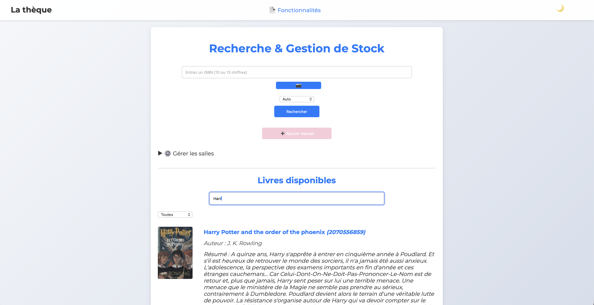
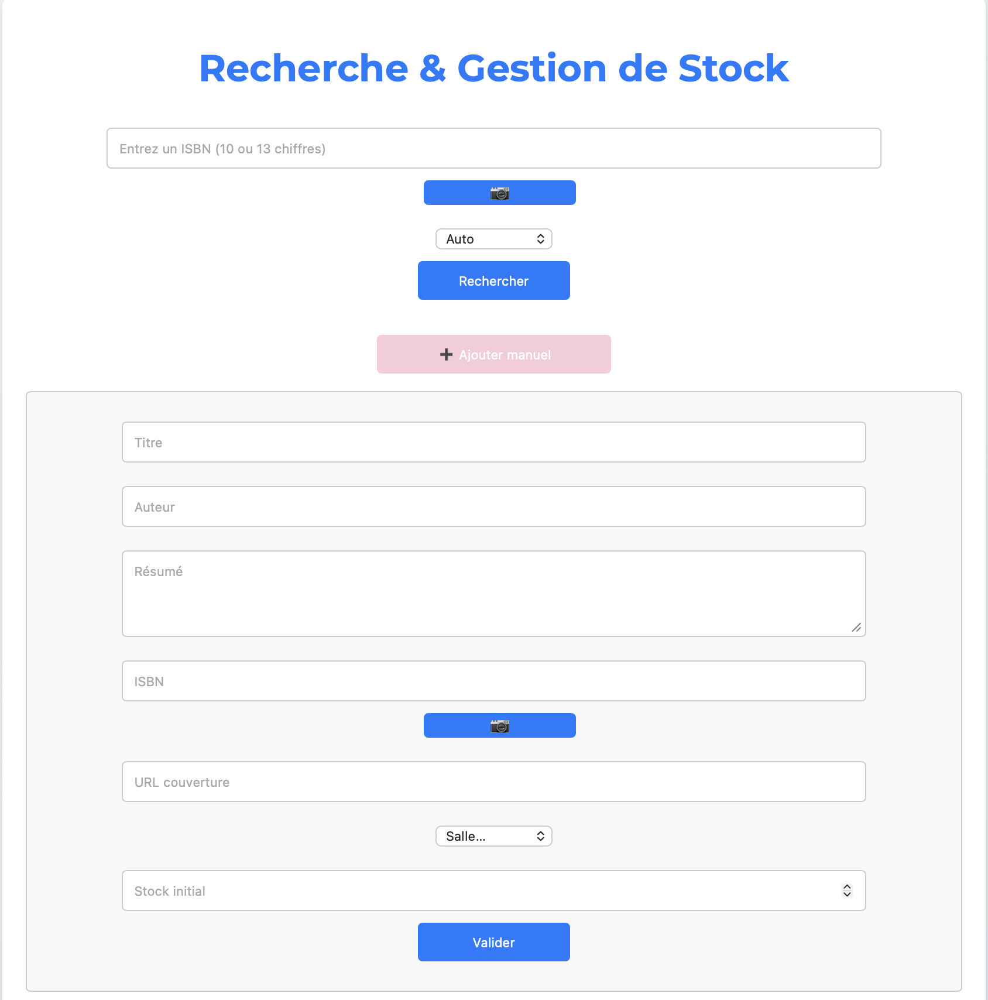

📚 La Thèque - Gestionnaire de Bibliothèque Intelligent

  

Une solution web complète pour gérer votre stock de livres de manière simple, moderne et efficace.

📖 À quoi sert ce projet ?
Ce projet est une application web conçue pour l'inventaire et la gestion de livres en temps réel. Grâce à une interface intuitive et une synchronisation avec Firebase, vous pouvez transformer n'importe quel appareil en un véritable outil de bibliothécaire.

✨ Fonctionnalités clés :

Recherche par ISBN : Identifiez rapidement un livre grâce à son numéro unique.

Fiches Détaillées : Affichage automatique des informations essentielles (titre, auteur, résumé et couverture).

Gestion de Stock : Suivez en temps réel la disponibilité de chaque ouvrage.

Administration simplifiée : Ajoutez, mettez à jour ou supprimez des livres en quelques clics.

Synchronisation Cloud : Toutes vos données sont sauvegardées et accessibles instantanément via Firebase.

🖼️ Aperçu de l'Interface
🔍 Consultation et Recherche

L'interface principale permet de parcourir la collection existante avec une barre de recherche ultra-rapide.

➕ Ajout et Gestion

Un formulaire complet permet d'enrichir la base de données manuellement ou via la recherche ISBN.

🛠️ Stack Technique
Frontend : HTML5, CSS3 (Design responsive), JavaScript ES6.

Backend & Base de données : Firebase Realtime Database pour le stockage en temps réel.

Outils : Intégration d'API pour la récupération automatique des données de livres.
